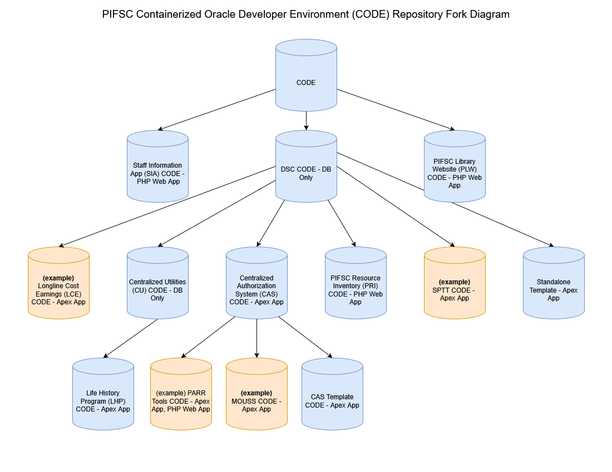
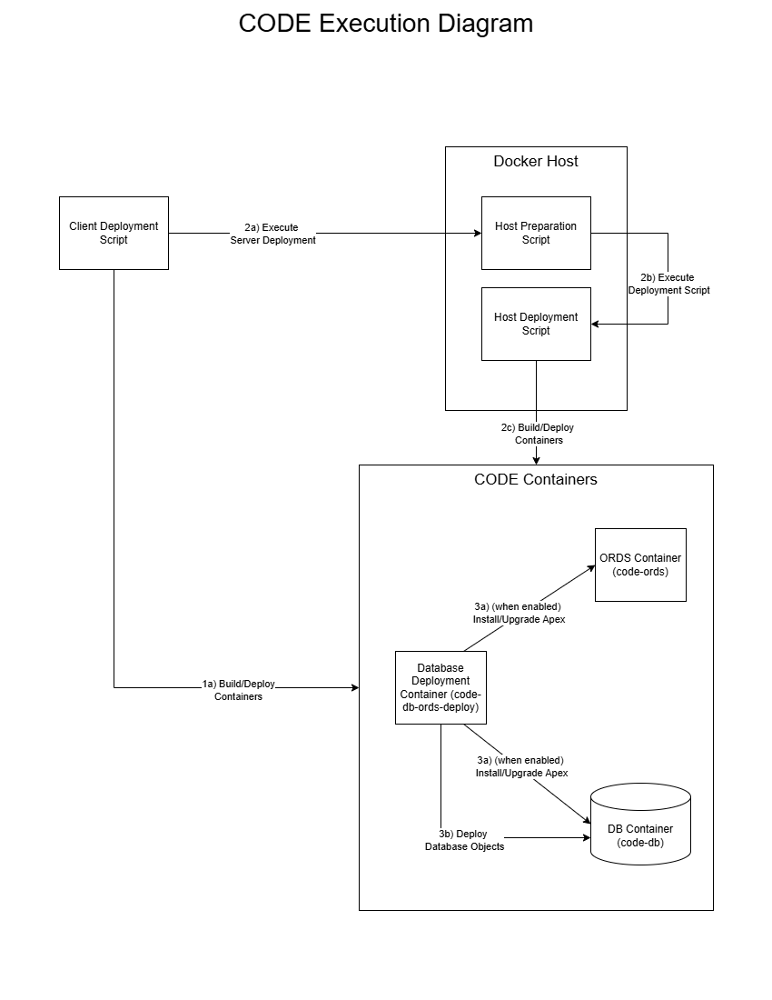

# PIFSC Containerized Oracle Developer Environment

## Overview
The PIFSC Containerized Oracle Developer Environment (CODE) framework was developed to provide an Oracle development environment for PIFSC software developers.  The framework can be extended to automatically create/deploy database schemas and applications to allow data systems with dependencies to be developed and tested using the CODE.  This repository or any other forked CODE repository can be forked to customize CODE for a specific data system and integrate its dependencies.  

## Resources
-   ### CODE Version Control Information
    -   URL: https://github.com/noaa-pifsc/PIFSC-Containerized-Oracle-Development-Environment
    -   Version: 1.4 (git tag: CODE_v1.4)
-   [CODE Demonstration Outline](./demonstration_outline.md)
-   [CODE Repository Fork Diagram](./diagrams/CODE_fork_diagram.drawio.png)
    -   [CODE Repository Fork Diagram source code](./diagrams/CODE_fork_diagram.drawio)
-   [CODE Execution Diagram](./diagrams/CODE_execution_diagram.drawio.png)
    -   [CODE Execution Diagram source code](./diagrams/CODE_execution_diagram.drawio)
-   CODE Development Workflow Diagrams:
    -   [Scenario 1 Diagram](./diagrams/CODE%20dev%20workflow%20diagram%20scenario%201.drawio.png)
        -   [Scenario 1 Diagram source code](./diagrams/CODE%20dev%20workflow%20diagram%20scenario%201.drawio)
    -   [Scenario 2 Diagram](./diagrams/CODE%20dev%20workflow%20diagram%20scenario%202.drawio.png)
        -   [Scenario 2 Diagram source code](./diagrams/CODE%20dev%20workflow%20diagram%20scenario%202.drawio)

## Intended Use
-   The CODE project is NOT intended for production use, it was developed to provide a containerized development and testing environment. There has been no rigorous security hardening process that complies with federal security requirements. 
-   The CODE project can be used to develop and test features and applications without requiring System Administrator support. The user specifies the administrator passwords when the container is run so they can make system-level configuration changes directly in the database or ORDS containers and then provide the working configuration settings to the System Administrator for implementation in the enterprise test and production environments.

## Requirements
-   Client machine:
    -   Bash (Linux) or Git Bash (Windows)
    -   The git merge strategy requires the merge.ours.drive to be enabled:
        -   Global configuration: 
            -   `git config --global merge.ours.driver true`
        -   Working copy configuration (execute the following command in each working copy of the CODE or forked CODE repositories): 
            -   `git config merge.ours.driver true`
    -   For remote container deployments only:
        -   SSH is setup to work with CAC authentication
        -   SSH is configured to specify the username in the ~/.ssh/config file for each container host (e.g. docker_dev for the dev container host)
            -   The ForwardAgent feature is enabled to allow the git repositories to be cloned on the container host
-   Container host:
    -   Docker
    -   dos2unix
    -   git
-   Data System Prerequisites:
    -   Automated database deployment scripts that can be executed via SQL*Plus are required for individual project repositories that are implemented as git submodules for a given CODE fork 

## Container Host Instances
-   For the development container and database instances the abbreviation used is "dev" 
-   For the test container and database instances the abbreviation used is "test" 

## Dependencies
\* Note: all dependencies are implemented as git submodules in the [/core/modules](../modules) folder
-   ### Container Deployment System (CDS) Module Version Control Information
    -   folder path: [/core/modules/CDS](../modules/CDS)
    -   Version Control Information:
        -   URL: <git@github.com:noaa-pifsc/PIFSC-Container-Deployment-System.git>
        -   Version: 1.3 (Git tag: pifsc_container_deployment_system_v1.3)

## Container Architecture
-   The code-db container is built from an official Oracle database image, this is defined by $DB_IMAGE in the [file-based configuration](#file-based)
-   The code-db-ords-deploy container is built from a custom dockerfile ([Dockerfile.deploy](../build/Dockerfile.deploy)) that uses an official Oracle InstantClient image with some custom libraries installed.  
    -   This container waits until the code-db container is running and the service is healthy before running the [container_deploy_database.sh](../scripts/container_scripts/container_deploy_database.sh) bash script
        -   The script will then deploy all database schemas, database objects, and when applicable the Apex workspaces, and Apex apps
        -   \*Note: Refer to the [file-based runtime configuration](#file-based) for relevant business rule information
    -   Once the code-db_ords_deploy container finishes deploying the database schemas/apps the container will shut down.  
-   The code-ords container is built from an official Oracle ORDS image, this is defined by $ORDS_IMAGE in the [file-based configuration](#file-based)  
    -   This container runs [ords_startup.sh](../scripts/ords_scripts/ords_startup.sh) in the container before the ORDS container's official docker entrypoint executes. This script specifies the required Apex and ORDS configuration
        -   \*Note: the apex configuration files are generated instead of using the CLI ORDS commands to specify the configuration because each CLI command took several seconds to execute.

## Naming Conventions
-   ### Functions
    -   The function naming convention follows the [namespace]\_[scope]\_[action] format, allowing developers to instantly identify the module a function belongs to and the execution environment where it is designed to run.
    -   Namespace: code_
    -   Execution Scopes: 
        -   client_: Executes on the developer workstation.
        -   container_: Executes within the container.
        -   host_: Executes on the remote container host server.
        -   shared_: Utilities utilized across multiple execution scopes.
    -   Resources: 
        -   [CDS function naming conventions](../modules/CDS/README.md#functions)
-   ### Variables
    -   The CODE follows the defined [CDS variable naming conventions](../modules/CDS/README.md#variables)

## Repository Fork Diagram
-   The CODE repository is intended to be forked for specific data systems
-   The [CODE Repository Fork Diagram](./diagrams/CODE_fork_diagram.drawio.png) shows the different example and actual forked repositories that could be part of the suite of CODE repositories for different data systems
    -   The implemented repositories are shown in blue:
        -   [CODE](https://github.com/noaa-pifsc/PIFSC-Containerized-Oracle-Development-Environment)
            -   The CODE is the first repository shown at the top of the diagram and serves as the basis for all forked repositories for specific data systems
        -   [DSC CODE](https://github.com/noaa-pifsc/PIFSC-DSC-Containerized-Oracle-Development-Environment)
        -   [Centralized Authorization System (CAS) CODE](https://github.com/noaa-pifsc/PIFSC-CAS-Containerized-Oracle-Development-Environment)
        -   [PIFSC Resource Inventory (PRI) CODE](https://github.com/noaa-pifsc/PIFSC-PRI-Containerized-Oracle-Development-Environment)
        -   [Centralized Utilities (CU) CODE](https://github.com/noaa-pifsc/PIFSC-CU-Containerized-Oracle-Development-Environment)
        -   [Life History Program (LHP) CODE](https://github.com/noaa-pifsc/PIFSC-LHP-Containerized-Oracle-Development-Environment)
    -   The examples or repositories that have not been implemented yet are shown in orange  


## CODE Folder Structure
-   ### Project-Specific CODE Folder Structure
    -   The [core](../) folder contains the core CODE framework source code
        -   \*Note: no files in this folder should be modified in any forks, this is meant to be upgraded over time by pulling upstream changes from the CODE repository
        -   The [build](../build) folder contains the container build configuration files (.yml, Dockerfile, etc.) for the CODE framework
        -   The [docs](../docs) folder contains the documentation for the CODE framework
        -   The [modules](../modules) folder contains the git submodules implemented for the CODE framework
        -   The [scripts](../scripts) folder contains all of the CODE framework's scripts defined for the different scopes  
            -   The [client_scripts](../scripts/client_scripts) folder contains scripts to execute on the client computer
            -   The [CODE_functions](../scripts/CODE_functions) folder contains CODE framework function definitions that are used in the different CODE scopes (client, host, container) 
            -   The [config](../scripts/config) folder contains configuration files to define the CODE configuration
            -   The [container_scripts](../scripts/container_scripts) folder contains scripts to execute within the container
            -   The [host_scripts](../scripts/host_scripts) folder contains scripts to execute on the container host
            -   The [ords_scripts](../scripts/ords_scripts) folder contains scripts to run during the startup process of the ORDS container to configure the service
        -   The [templates](../templates) folder contains a template for implementing the CODE framework from a forked repository, either directly from the CODE project or one of its forked repositories (at any depth) 
            -   \*Note: this folder was created so it can be copied into the /projects folder of the forked repository and renamed based on the project the CODE fork implements
    -   The [logs](../../logs) folder contains the log files from each CODE framework deployment process
    -   The [projects](../../projects) folder contains separate folders for each forked CODE repository to support the dependencies of the given CODE fork's project
        -   \*Note the dependencies can be database schemas/objects, apex applications, or container applications 
        -   Each "project name" subfolder represents a fork of the CODE project or a fork of a forked CODE project 
            -   The "build" subfolder contains the container build configuration files (.yml, Dockerfile, etc.) for the CODE framework
            -   The "config" subfolder contains the configuration files for the specific CODE framework implementation
            -   The "docs" subfolder contains the documentation for the specific CODE framework implementation
            -   The "hooks" folder contains any pre- or post-processing scripts that follow the standard naming convention that can automatically run in the specified scope (client, host, container) 
            -   The "modules" subfolder contains the git submodules implemented for the specific CODE framework implementation
    -   The [secrets](../../secrets) folder must be populated with a secrets.sh file that contains the definition for all secret variables used in the given CODE framework implementation (these files are not committed to version control)
    -   The [README.md](../../README.md) file documents the CODE module
-   ### CODE Folder Diagram:
    ```
    .
    |--- core
    |    |--- build
    |    |--- docs
    |    |--- modules
    |    |--- scripts
    |    |    |--- client_scripts
    |    |    |--- CODE_functions
    |    |    |--- config
    |    |    |--- container_scripts
    |    |    |--- host_scripts
    |    |    |--- ords_scripts
    |    |--- templates
    |--- logs
    |--- projects
    |    |--- project_name
    |    |    |--- build
    |    |    |--- config
    |    |    |--- docs
    |    |    |--- hooks
    |    |    |--- modules
    |--- secrets 
    |    |--- secrets.sh
    |--- README.md
    ```

## CODE Business Rules
-   ### Linear Dependency Example
    -   If Project C forks Project B, then Project B is a direct linear dependency of Project C and Project A is an indirect linear dependency of Project C.  
-   ### Project Linear Dependency Configuration
    -   To support complex, layered systems, CODE implements a cascading linear dependency model:
        -   Each subfolder in the [/projects](../../projects) folder represents a CODE fork and contains its specific configurations and any associated custom bash code 
        -   #### Active Project
            The [projects/.active_project](../../projects/.active_project) file defines the current active project via the $ACTIVE_PROJECT_NAME variable, which references a CODE fork folder in the [/projects](../../projects) folder that is implemented in the corresponding forked repository.   
                -   \*Note: In the [linear dependency example](#linear-dependency-example) $ACTIVE_PROJECT_NAME = project C's folder name
        -   #### Linear Dependences
            -   The projects/\[PROJECT_NAME\]/config/project_parent_config.sh establishes the parent-child relationships via the $PROJECT_FOLDER_NAME variable that references the corresponding [/projects](../../projects) subfolder.
                -   \*Note: In the [linear dependency example](#linear-dependency-example), for project B the $PROJECT_FOLDER_NAME = Project A's folder name, and for Project C the $PROJECT_FOLDER_NAME = Project B's folder name
                -   \*Note: If there is no direct linear dependency for the given project $ACTIVE_PROJECT_NAME is blank, in the [linear dependency example](#linear-dependency-example) this applies to Project A
        -   #### Top-Level Parent
            -   The forked repository at the top of the linear dependency chain. In the [linear dependency examples](#linear-dependency-example) the top-level parent is Project A.
    -   #### Configuration Arrays:
        -   Each time the CODE framework runs it will iterate through the defined configuration arrays and perform the defined actions
        -   The configuration arrays are defined in the corresponding projects/\[PROJECT_NAME\]/config/project_manifest_config.sh file:
            -   $CUSTOM_ENV_VARS defines custom environment variables that will be declared based on the corresponding bash variables so they are available to the containers and client/host scripts, these will be declared in the order they were added to the $CUSTOM_ENV_VARS variable
			-   $DB_SCRIPTS_MAP defines specific database scripts and their corresponding credentials so they can be executed within the code-db-ords-deploy container, the corresponding scripts will be executed in the order they were added to the $DB_SCRIPTS_MAP variable
                -   This is a pipe (|) delimited string of 4 or more values in the following order:
                    -   #1: sql path: the absolute path the sqlplus script should execute from
                        -   **Note: the $BUILD_PATH folder path value (/core/build/) can be used when defining the path to simplify the process
                    -   #2: sql script file: the relative path and sql script name that is executed within the container (e.g. @dev_container/create_schemas.sql) 
                    -   #3: Username Secret Name: defines the secret name for the database username used when authenicating to the database
                    -   #4: Password Secret Name: defines the secret name for the database password used when authenicating to the database 
                    -   #5-n: Script Password Secret: (optional) defines the secret name for the script password parameter specified to the script (examples include CREATE USER scripts so the passwords can be specified at runtime)
            -   $SECRET_MAPPING_ARR is an associative array that defines the relationship between secret names (element name) and secret bash variable names (element value). The secret bash variable names must match variables declared in the secrets.sh file
                \*Note: when the automated deployment scripts in the CODE framework execute it will automatically define the corresponding container secrets (with a prefix of $COMPOSE_PROJECT_NAME to help ensure they are unique) so they are available in the corresponding containers 
                -   Any new secret names that are implemented in code-db-ords-deploy by scripts that are defined in $DB_SCRIPTS_MAP will require a new project-specific custom container .yml file to be created in the project's build folder and then added to the COMPOSE_FILES array                    
	            -   The array element values must correspond to the secret variables specified in secrets.sh. The array element names must correspond to the actual secret names used in the given container.
            -   COMPOSE_FILES defines the custom container .yml files that will be included when the CODE framework runs, these will be included in the order they were added to the COMPOSE_FILES variable
            	-   \*Note: When specifying a new .yml file, the path must be relative to the /core/build folder  
                -   \*Note: For project-specific container applications, additional .yml files can be added tio the COMPOSE_FILES array to reference the corresponding [modules](../templates/project_name/modules) directory to include the containers in the CODE container deployment
                    -   \*Note: Additional .yml files that were added to the corresponding project-specific [build](../templates/project_name/build/) folder can be added to the COMPOSE_FILES array to override the associated container configuration for the CODE implementation  
-   ### Script and Configuration Order
    -   For all of the project-specific functionality (hooks, compose files, database deployment scripts, configuration variables) the order of execution will start with the Top-Level Parent repository and then through each of the direct linear dependencies until the Active Project to respect the project dependencies.
    -   The following examples are based on the [linear dependency example](#linear-dependency-example):
        -   For configuration files: when the compose files are included, project A's configuration variables are defined first and then project B's are defined which will overwrite any duplicate variables defined by project A, and then Project C's are defined. 
        -   For project hierarchy array variables: Project A's configuration array elements are added before Project B's configuration array elements, and then Project C's configuration array elements are added.
        -   For hooks and database deployment scripts: Project A's scripts are run first, then Project B's scripts, and then Project C's scripts.
-   ### Secret Definitions
    -   The /secrets/secrets.sh file's defines global bash variables for various database and API credentials
        -   The global bash variable definitions must match $SECRET_MAPPING_ARR array element values to be implemented successfully
        -   \*Note: The secrets.sh will only set the oracle database administrator password to $ORACLE_PWD on the initial database container run. On the initial run and subsequent runs it will set the APEX and ORDS administrator passwords to $ORACLE_PWD and use the defined $ORACLE_PWD to authenticate to the database
            -   \*Note: this approach allows the Apex installation to be stateless, so even if the apex volume is dropped it will be rebuilt with the corresponding $TARGET_APEX_VERSION next time the container runs.  
    -   The .yml configuration files must have matching secret declarations to use the corresponding container secrets that are defined in the $SECRET_MAPPING_ARR 
-   ### Runtime Configuration
    -   #### User-Defined
        -    script_action: the type of script that is executed - "deploy" for CODE containers deployments and "shutdown" for shutting down the CODE containers
        -   env_name: environment name is "dev" for development scenarios, "test" for testing scenarios
            -   dev scenarios are intended for developing incremental changes to the database and test scenarios are intended to test the entire set of combined database changes starting from a known database state before they are deployed on the test and production enterprise databases   
            -   \*Note: when the env_name is "dev" it will retain the database across CODE container restarts
        -   deploy_dest: deployment destination - "local" for docker desktop CODE deployments and "server" for linux host deployments
        -   rem_vol: remove volume flag is "yes" to remove the volumes associated with the CODE container stack name or "no" to retain the volumes
            -   \*Note: if a volume is removed the data contained within it is lost, caution is advised to ensure that work is not lost or it's saved before the volume(s) are removed.
    -   #### File-Based    
        -   \*Note: the file-based runtime configuration is defined in [default_CODE_runtime_config.sh](../scripts/config/default_CODE_runtime_config.sh) and in each linear dependency defined in the [projects](../../projects) folders in the config/project_runtime_config.sh file (starting with the Top-Level Parent down through the linear dependency chain until the $ACTIVE_PROJECT_NAME)
        -   \*Note: when deploying the CODE framework to a server, the file-based runtime configuration variables defined on the client computer will be used when deploying the CODE containers (otherwise the configuration variables would be overwritten by the configuration variables defined in the cloned repository on the server)
        -   $APP_SCHEMA_NAME is the database schema that will be used to check if the database schemas have been installed, this only applies to the [development runtime scenario](#development)
        -   $DB_IMAGE is the path to the database image used to build the database container (code-db container)
            -   This can be updated if a specific version of the database is required
        -   $ORDS_IMAGE is the path to the ORDS image used to build the ORDS/Apex container (code-ords container)
            -   This can be updated if a specific version of ORDS is required
        -   $TARGET_APEX_VERSION is the version of apex that will be installed/upgraded to when the CODE framework instance is deployed
            -   For development scenarios the $TARGET_APEX_VERSION variable defined cannot be decreased once a given version of apex has been insalled on the code-db database container. If a downgrade is required the database volume (code-db-vol) needs to be deleted and then the container must be run again to install the desired version of Apex.  
        -   $ORDS_ENABLED (yes/no) defines if the ORDS service is enabled (yes) or not enabled (no). This must be "yes" for Apex/ORDS functionality to be available
        -   If $ORDS_ENABLED="yes" and $TARGET_APEX_VERSION is a valid version of Apex the script will install/upgrade Apex in the code-db and code-ords containers when the CODE framework runs
            -   If $ORDS_ENABLED is "yes" and the $TARGET_APEX_VERSION variable is defined and valid, then it will install the matching version of Apex version in the code-db and code-ords container.
                -   If $ORDS_ENABLED is "yes" then the [CODE-ords.yml](../build/CODE-ords.yml) file is loaded during the building/running of the CODE containers to make the ORDS/Apex container available. 
            -   If $ORDS_ENABLED is "no" then the ORDS/Apex container is omitted from the CODE containers.
        -   Concurrent CODE deployments:
            -   In order for multiple CODE deployments to run concurrently on the same container host the following configuration variables must be unique:
            -   $COMPOSE_PROJECT_NAME is a text string used to prefix container object names (secrets, stack, network, etc.) to help prevent naming collisions so the same CODE/fork project can run concurrently on the same host server 
                -   for server deployments this will determine the container name and the folder name for the working copy of the repository on the server
            -   $DB_HOST_PORT is the port that the Oracle database will be available from on the container host
            -   $ORDS_HOST_PORT is the port that ORDS will be available from on the container host
        -   Host deployment configuration:
            -   $GIT_URL is the git project that will be used to build and deploy the CODE containers
            -   $PRIV_USER is the privileged user on the docker host that will be used to build and deploy the CODE containers
            -   $HOSTNAME is the hostname of the docker host where the CODE containers will be deployed
-   ### Automated Hooks
    -   Project-specific hooks are defined for specific timing (pre- or post-) and scope (client, host, container)
        -   The hooks will execute right before and right after the main action for the given scope.
        -   Timing:
            -   Pre: The pre action hook will execute immediately before the main action executes
            -   Post: The pre action hook will execute immediately after the main action completes
        -   Scope:
            -   client_local: For local CODE deployments, the main action is building and deploying the CODE container stack. For server deployments, the main action is executing the bash script to deploy the container remotely on the container host  
            -   client_server: For server CODE deployments, the main action is sending the ssh command to the server to execute the CODE deployment            
            -   host_prepare: For server CODE Deployments, the main action is executing the host deployment script using the designated account with elevated container privileges  
            -   host_deploy: For server CODE Deployments, the main action is building and deploying the CODE container stack
            -   container: The main action is executing the database scripts to update the database and/or install apex application(s)
    -   The naming convention for these files is: [timing]_[scope]_hook.sh. For example, pre_container_hook.sh will run immediately before the database scripts are executed within the container
    -   These hook script files are saved in the corresponding project fork's /projects/project_name/hook folder

## CODE Implementation Procedure
-   \*Note: this process will fork a given CODE or CODE fork repository and configure it as a project-specific CODE repository
-   ### Forking the Repository
    -   Fork the desired CODE repository (e.g. [CODE](#code-version-control-information))
        -   In the git web interface update the name/description of the forked project to specify the data system that is implemented
    -   Clone the forked project recursively to a working directory
        -   In the working copy of the given CODE fork repository, add the "upstream" repository using the git remote:
            ```
            # Add the upstream repository and name it "upstream"
            # Replace [$GIT_URL] with the actual SSH Git URL of the parent repository
            git remote add upstream [$GIT_URL]

            # Verify that both "origin" (your fork) and "upstream" are listed
            git remote -v
            ```
-   ### CODE Template 
    -   Copy the [project template](../templates/project_name) folder into the [/projects](../../projects) folder
        -   \*Note: Do not modify any of the other folders within the [/projects](../../projects) folder since those are managed in upstream forked CODE repositories.
        -   Rename the copied "project_name" template folder to a descriptive name for the project (e.g. staff-info-app, longline-cost-earnings)
            -   \*Note: Refer to [project linear dependency configuration](#project-linear-dependency-configuration) for relevant business rule information about [/projects](../../projects) subfolders
        -   Update the [.active_project](../../projects/.active_project) file to set the value of $ACTIVE_PROJECT_NAME variable value to the name of the renamed project folder
            -   This indicates to the CODE framework which project is the active project, refer to the [project linear dependency configuration](#active-project) for details  
        -   #### Forked Project Customization
            -   Update the [projects/$ACTIVE_PROJECT_NAME/config/project_parent_config.sh](../templates/project_name/config/project_parent_config.sh) configuration file to set $PROJECT_FOLDER_NAME to the name of the folder in the [/projects](../../projects) folder that contains the current project's direct linear dependency
                -   Refer to the [project linear dependency configuration](#linear-dependencies) for relevant business rule information
                -   \*Note: The parent project's $ACTIVE_PROJECT_NAME value can be copied into the $PROJECT_FOLDER_NAME variable for the current project to define the direct dependency
            -   Rename and update the [projects/$ACTIVE_PROJECT_NAME/build/secrets.template.yml](../templates/project_name/build/secrets.template.yml) template file to define any additional secrets for the code-db-ords-deploy container and any configuration overrides for containers that are being added for the forked repository
                -   (When applicable) If there are container application(s) associated with the given project, additional .yml files can be added in the corresponding project-specific [build](../templates/project_name/build/) folder to override the associated container configuration values
                    -   \*Note: Refer to the [PRI CODE](https://github.com/noaa-pifsc/PIFSC-PRI-Containerized-Oracle-Development-Environment) for an example of a configured CODE container application ([custom_pri.yml](https://github.com/noaa-pifsc/PIFSC-PRI-Containerized-Oracle-Development-Environment/blob/main/projects/PRI/build/custom_pri.yml)) 
1                -   \*Note: Refer to [Secret Definitions](#secret-definitions) for details about the project-specific .yml files
            -   Add any project-specific repository dependencies as git submodules in the [modules](../templates/project_name/modules/) subfolder
            -   Update the [projects/$ACTIVE_PROJECT_NAME/config/project_manifest_config.sh](../templates/project_name/config/project_manifest_config.sh) configuration file with the basic information about the forked CODE implementation:
                -   \*Note: Refer to the [Configuration Arrays](#configuration-arrays) section for relevant business rules for the following arrays:
                -   PROJECT_LINEAR_DEPENDENCIES should add an array element with the $ACTIVE_PROJECT_NAME 
                -   $DB_SCRIPTS_MAP: add an array element for each automated database deployment script that will be run on deployments with the corresponding secret names
                -   $CUSTOM_ENV_VARS array values for any custom environment names that need to be transmitted to any of the containers on startup
                -   COMPOSE_FILES to add any .yml files from the project's repository and/or any configuration overrides
                -   $SECRET_MAPPING_ARR array elements/values that correspond to the secret name (element name) and the corresponding bash variable defined in the secrets.sh as the value
            -   Update the [projects/ACTIVE_PROJECT_NAME/config/project_runtime_config.sh](../templates/project_name/config/project_runtime_config.sh) configuration file with any global configuration variable values that are specific to this project (e.g. $COMPOSE_PROJECT_NAME, $APP_SCHEMA_NAME, $GIT_URL, $ORDS_ENABLED, $TARGET_APEX_VERSION, etc.)
                -   For more information refer to the [File-Based Runtime Configuration Business Rules](#file-based) section
            -   Create any special hooks in the [projects/$ACTIVE_PROJECT_NAME/hooks](../templates/project_name/hooks) folder with the defined naming convention based on the timing and scope of the hook
                -   For more information refer to the [Automated Hooks](#automated-hooks) section for relevant business rule information 
            -   Rename and update the [projects/$ACTIVE_PROJECT_NAME/docs/CODE Fork Documentation.template.md](../templates/project_name/docs/CODE%20Fork%20Documentation.template.md) documentation template
                -   Update the documentation to specify any relevant information about the forked repository   
                    -   The "Upstream Repositories" section should list all of the forked repository's parent repositories
                    -   The "Custom Dependencies" section should list all dependencies of the current forked repository as well as all the forked repository's parent repositories
                -   Refer to the [CTP Fork Documentation](https://github.com/noaa-pifsc/PIFSC-CTP-Containerized-Oracle-Development-Environment/blob/main/projects/CTP/docs/CTP%20CODE%20Fork%20Documentation.md) for an example of a forked CODE project with two levels of direct linear project dependencies
            -   Update the [secrets.template.sh](../../secrets/secrets.template.sh) template file to include placeholder variables for any secret values used inside of the forked repository.
                -   \*Note: Refer to [Secret Definitions](#secret-definitions) for details about the secrets.sh variables for a given CODE fork
-   Update the [README.md](../../README.md) file to reference the renamed [projects/$ACTIVE_PROJECT_NAME/docs/CODE Fork Documentation.template.md](../templates/project_name/docs/CODE%20Fork%20Documentation.template.md) documentation template so each CODE fork's documentation is accessible from the README
-   ### Implementation Examples
    -   Standalone database with no dependencies: [DSC CODE](https://github.com/noaa-pifsc/PIFSC-DSC-Containerized-Oracle-Development-Environment)
    -   Oracle database and PHP web container application: [Staff Information Application (SIA) CODE](https://github.com/noaa-pifsc/PIFSC-SIA-Containerized-Oracle-Development-Environment)
    -   Oracle database and Apex application: [Centralized Authorization System (CAS) CODE](https://github.com/noaa-pifsc/PIFSC-CAS-Containerized-Oracle-Development-Environment)
    
## Setup
-   Recursively clone the given CODE project to a directory on the local client computer
-   Within the project repository create the necessary bash file with the secret values for each database schema and apex workspace: secrets.sh in the [/secrets](../../secrets) folder
    -   \*Note: There is a [secrets template](../../secrets/secrets.template.sh) file that can be used to create the secrets.sh file for each database instance 
    -   \*Note: the actual secret files should never be committed to the repository for security purposes, a [.gitignore](../../.gitignore) file has been added to the repository to prevent these sensitive files from being included in git.  
    -   \*Note Refer to the [Secret Definitions](#secret-definitions) section for relevant business rules
-   ### Runtime Scenarios
    -   #### Standalone CODE Repository
        -   \*Note: the CODE framework can be run directly from the CODE repository to provide a standard Oracle development environment with minimal setup. 
        -   \*Note: the CODE repository can also be forked to customize the standard Oracle development environment   
        -   Update the [default_CODE_runtime_config.sh](../scripts/config/default_CODE_runtime_config.sh) configuration file to specify the appropriate runtime configuration
    -   #### Custom Forked Repository
        -   \*Note: the CODE repository forks can customized for specific data systems and then those forks can be forked to build on those specific data system dependencies.
        -   Update the [/projects/$ACTIVE_PROJECT_NAME/config/project_runtime_config.sh](../templates/project_name/config/project_runtime_config.sh) configuration file to specify the appropriate runtime configuration 
-   To allow multiple developers to use CODE concurrently on the same container host, update the three variables identified in the top section: $COMPOSE_PROJECT_NAME, $DB_HOST_PORT, and $ORDS_HOST_PORT to have unique values
    -   \*Note: refer to the the [file-based configuration](#file-based) for relevant business rule information under the "Concurrent CODE deployments" section
-   ### Container Host
    -   (One-time setup) Setup docker swarm: `docker swarm init`

## Executing the CODE Project
-   Following the [Setup](#setup) process, execute the [client_execute_CODE_scripts.sh](../scripts/client_scripts/client_execute_CODE_scripts.sh) script using bash and specify the appropriate script parameters:
    -   \*Note: refer to the the user-defined configuration [business rules](#user-defined) for more information
    -   script_action: the type of script that is executed - "deploy" for CODE containers deployments and "shutdown" for shutting down the CODE containers
    -   env_name: environment name - "dev" for development, "test" for testing purposes)
        -   \*Note: when the env_name is "dev" it will retain the database across CODE container restarts
    -   deploy_dest: deployment destination - "local" for docker desktop CODE deployments and "server" for linux host deployments
    -   rem_vol: remove volume flag - "yes" to remove the volumes associated with the CODE container stack name or "no" to retain the volumes
        -   \*Note: if a volume is removed the data contained within it is lost, caution is advised to ensure that work is not lost or it's saved before the volume(s) are removed.
        -   \*Note: scenarios where a volume should be removed include: a lower version of Apex is required for a given Apex application, or the database data needs to be replaced or re-seeded.
    -   Examples:
        -   Executing a deployment for a development environment locally without removing the volumes first: 
            -   `bash client_execute_CODE_scripts.sh deploy dev local no`
        -   Executing a shutdown for a development environment on the server and remove the associated volumes: 
            -   `bash client_execute_CODE_scripts.sh shutdown dev server yes`
-   ### Runtime Scenarios:
    -   There are two different runtime scenarios implemented in this project. Both scenarios implement a docker volume for the Apex static files (apex-static-vol) that are used in the Apex upgrade process
    -   The $ORDS_ENABLED global bash variable determines if the ORDS/Apex container is enabled
        -   \*Note: Refer to the [file-based configuration](#file-based) for relevant business rules
    -   #### Development:
        -   (env_name = "dev") This scenario retains the database across container restarts, this is intended for database and application development purposes
        -   This scenario implements a docker volume for the database files (code-db-vol) to retain the database data across container restarts
        -   \*Note: refer to the the file-based configuration [business rules](#file-based) for more information about $TARGET_APEX_VERSION
        -   \*Note: the initial container run can take up to approximately 30 minutes depending on the resources allocated to the container platform software since the database is initialized and when $ORDS_ENABLED is "yes" it also installs Apex on the ORDS container
    -   #### Test:
        -   (env_name = "test") This scenario does not retain the database across container restarts, this is intended to test the deployment process of schemas and applications
        -   \*Note: the container run process can take up to approximately 30 minutes depending on the resources allocated to the container platform software since the database is initialized and when $ORDS_ENABLED is "yes" it also installs Apex on the ORDS container
    -   \*Note: development and test deployments can be run concurrently to allow flexible software development workflows. 
        -   For example, a development instance can be used for incremental development and the updated database scripts can be periodically tested by deploying them with a test environment to ensure the database deployment process works properly. The database diff tool can be used to ensure the deployment process on the test instance produces the same data model as the development instance    
-   A log file for each client script execution is saved in the [logs](../../logs) folder and is named client_deploy_application.sh.$(date +%Y%m%d_%H%M%S).log based on the date/time the script is executed.  This file will include the output from the remote host and container scripts
-   ### CODE Execution Diagram
    -   The [CODE execution diagram](../docs/diagrams/CODE_execution_diagram.drawio.png) provides an overview of the CODE execution for both server and local deployments.
    -   Local Deployments:     
        -   (Shown as 1a) The Client Deployment Script runs to build and deploy the CODE Containers locally using Docker Desktop
    -   Server Deployments:
        -   (Shown as 2a) The Client Deployment Script runs and uses SSH to clone the repository and execute the Host Preparation Script
        -   (Shown as 2b) The Host Preparation Script runs and uses the "sudo -u" command to run the Host Deployment Script with a privileged server user that can run container commands
        -   (Shown as 2c) The Host Deployment Script runs to build and deploy the CODE Containers on the Docker Host
    -   CODE Container Deployments (applies to both Local and Server deployments):
        -   The Database Deployment Container automatically runs on startup 
            -   (Shown as 3a) If $ORDS_ENABLED="yes" is enabled and $TARGET_APEX_VERSION is a valid version of Apex then the ORDS and DB containers will have the specified version of Apex installed
            -   (Shown as 3b) The custom project-specific scripts will execute to deploy the corresponding database objects    
    -   \*Note: Additional containers can be deployed using the COMPOSE_FILES variable from the custom [Configuration Arrays](#configuration-arrays)


## Contribution and Repository Management Guidelines
-   To keep the CODE ecosystem clean, maintainable, and free of merge conflicts, contributions must adhere to a strict division of responsibility between the Upstream Engine and Downstream Project Forks.
-   ### CODE Repository
    -   Only change files directly in the [CODE repository](#code-version-control-information) when updating the framework's universal core rules, fixing orchestration bugs, or updating base infrastructure templates.
    -   Where to make changes:
        -   [core](../) folder and subfolders where appropriate
    -   \*Note: Never hardcode any project-specific schemas, port configurations, secret structures, or git submodule paths. The engine must remain entirely project-agnostic and parameter-driven.
-   ### Downstream CODE Forks
    -   When customizing a specific CODE fork, developers must confine all modifications to project-specific configurations and corresponding submodules with the corresponding [projects](../../projects/) folder for the CODE fork
    -   In the [Script and Configuration Order](#script-and-configuration-order) example scenario, if the folder name for project B is "projectB", then the only folder project B should modify is projects/projectB
    -   \*Note: Do not change any of the file or folder names within the corresponding [projects](../../projects/) subfolder, the CODE framework uses specific filenames and folders to determine the behavior of the framework. 
-   ### CODE Development Workflow Recommendations
    -   \*Note: For this section the example forked repositories are listed below:
        -   Project A forks the CODE repository
        -   Project B forks Project A
        -   Project C forks Project B 
        -   Project D forks Project A
    -   There are two main scenarios for developing upgrades to the CODE framework:
        -   #### Improvements (Scenario 1)
            -   When existing CODE features are improved (e.g. refactor code, security updates) it is feasible to make and test the changes in the CODE repository directly
            -   The [Diagram](./diagrams/CODE%20dev%20workflow%20diagram%20scenario%201.drawio.png) shown below illustrates how the changes are propagated through the forked repository network:
                -   \*Note: The CODE forks are shown in blue
                -   Changes are developed and tested directly in the CODE repository
                -   The downstream forked CODE repositories pull the upstream changes through their direct linear dependencies (CODE -> Project A -> Project B -> Project C and CODE -> Project A -> Project D) 
                -   When each of the forked CODE repositories have been successfully tested:
                    -   The CODE project changes are merged and tagged as a release
                    -   The downstream forked CODE repositories' changes are merged and tagged as a release
            
        -   #### New Functionality (Scenario 2)
            -   When new CODE features are needed by a specific CODE fork, it can streamline the development workflow by making and testing the changes directly in the specific CODE fork. This approach is more direct than making updates to the CODE repository and other upstream CODE fork repositories and propagating them to the specific CODE fork before they can be tested which can add significant overhead to the development workflow. 
            -   The [Diagram](./diagrams/CODE%20dev%20workflow%20diagram%20scenario%202.drawio.png) shown below illustrates how the changes are propagated through the forked repository network:
                -   \*Note: The CODE forks are shown in blue
                -   To make chages to Project C, the following process can be used:
                    -   The [core](../) folder is modified to update the CODE core files
                    -   If required, Project A's and/or Project B's files within the corresponding [projects](../../projects/) subfolder is modified
                    -   Successfully test the changes within Project C
                    -   Apply the changes to the corresonding upstream repositories:
                        -   \*Note: the changes made via the diff tool are shown with orange connectors in the diagram 
                        -   A diff tool is used to compare the files in the [core](../) folder of the working copies of the CODE and Project C repositories to update the working copy of CODE
                        -   A diff tool is used to compare the files within each of the corresponding [projects](../../projects/) subfolders between the working copies of Project A and C as well as Project B and C to update the working copies of the corresponding upstream repositories
                        -   Project C commits the changes to the corresponding [projects](../../projects/) subfolder that belongs to Project C
                            -   Project C stashes all changes to the files/folders that are not within the corresponding [projects](../../projects/) subfolder that belongs to Project C
                -   Propagating Changes to CODE Forks:
                    -   \*Note: The white arrows show the direction of the upstream updates that are pulled from the individual CODE forks 
                    -   CODE commits and pushes its changes
                    -   Project A commits its changes and pulls the upstream changes from CODE, verifies Project A is working, and then pushes its changes 
                    -   Project B commits its changes and pulls the upstream changes from Project A, verifies Project B is working, and then pushes its changes 
                    -   Project C commits its changes and pulls the upstream changes from Project B, verifies Project C is working, and then pushes its changes 
                    -   Project D pulls the upstream changes from Project A, verify Project D is working, and then pushes its changes
        
-   ### Database Development Workflow Recommendations
    -   Deploy a development CODE instance with the foundational database model (current version used as a starting point)
    -   Make the data model changes to the development database and save the corresponding DDL in an upgrade file
    -   Periodically deploy the test CODE instance deployment that runs the DDL upgrade file 
    -   Use a database diff tool (e.g. SQL Developer) between the development and test instances to ensure the data models are equivalent
    -   Shutdown test instance when not actively in use to conserve resources

## Monitoring and Syncing Upstream Updates
-   Because the upstream engine (CODE) and project forks are hosted on GitHub, maintaining clear synchronization lines is key to pulling upstream features, bug fixes, and security patches seamlessly.
-   ### Watching Upstream Releases on GitHub
    -   To stay informed of important changes to the CODE framework:
        -   In the GitHub website, navigate to the given CODE fork's parent repository and use the "Watch" feature, and select "Releases" and "Security Alerts" to receive those notifications. 
            -   When new releases are made for the parent repository, they can be integrated into the given CODE fork by pulling the upstream changes.
        -   (Optional) In the GitHub website, navigate to the [CODE repository](#code-version-control-information) and use the "Watch" feature, and select "Releases" and "Security Alerts" to receive those notifications
            -   \*Note: Changes to the CODE repository must propagate through the chain of linear dependencies to the parent repository before they can be integrated into the given CODE fork repository.
-   ### Syncing Upstream Updates
    -   #### CODE Folder Structure and Policies
        -   This project has been structured specifically to minimize the need to merge upstream changes as the [CODE framework](#code-version-control-information) continues to evolve and accommodates chains of forked projects that have layered dependencies. 
        -   The [core](../) folder contains all of the CODE framework's source code so when changes are made to the [CODE repository](#code-version-control-information) those upstream changes can be pulled by the individual forked repositories without triggering merge conflicts
            -   \*Note: the core folder should only be modified in the CODE repository
        -   Each forked repository has its own dedicated project subfolder in the [/projects](../../projects) folder to prevent conflicts when merging upstream changes
        -   For a given [Active Project](#active-project), all other subfolders within the [/projects](../../projects) folder should never be modified, since those are managed in upstream forked CODE repositories.  
            -   Instead, when upstream changes are made they should be pulled by the corresponding forked projects based on their direct linear dependencies.
        -   Global bash array configuration variables are defined by the CODE framework and then the individual projects add elements to these arrays which determine the behavior of the CODE framework.
    -   #### Synchronization Procedure
        -   Pull the upstream changes including tags
        -   Resolve Any Conflicts:
            -   Because of the [.gitattributes](../../.gitattributes) configuration (.active_project merge=ours), any updates to the upstream project pointer ([.active_project](../../projects/.active_project)) will be silently and automatically ignored by Git so users don't need to manually merge the changes
            -   If conflicts occur in other files, resolve them using standard Git tools.
        -   Keep Shared Utilities (Submodules) in Sync:
            -   If the upstream engine modified the [CDS](../modules/CDS) module, or if any upstream forks have modified their project-specific modules, ensure the working copy's local submodules are updated to the tracked commits:
                ```
                git submodule update --init --recursive
                ```
        -   Push the merged and tested changes to the CODE fork 

## Connection Information
For the following connections refer to the active [file-based configuration](#file-based) and the /secrets/secrets.sh for the corresponding variable values
-   \*Note: For server deployments the following command can create an SSH tunnel between the server and the developer workstation to allow the following URLs to connect to the corresponding server endpoints:
    -   `ssh -N -L ${$ORDS_HOST_PORT}:localhost:${$ORDS_HOST_PORT} -L ${$DB_HOST_PORT}:localhost:${$DB_HOST_PORT} ${HOSTNAME}`
-   Database connections:
    -   hostname: localhost:\$\{DB_HOST_PORT\}/$\{DBSERVICENAME\}
    -   username: SYSTEM or SYS AS SYSDBA
    -   password: \$\{ORACLE_PWD\}
-   Apex server:
    -   hostname: http://localhost:\$\{ORDS_HOST_PORT}/ords/apex
    -   workspace: internal
    -   username: ADMIN
    -   password: \$\{ORACLE_PWD\}
-   ORDS server:
    -   hostname: http://localhost:\$\{ORDS_HOST_PORT\}/ords

## Security Features
-   The CODE project inherits security features from the [CDS module](../modules/CDS/README.md#security-features).
-   Decoupled Configuration Adapter Pattern: The core CODE engine enforces a strict Separation of Concerns. It remains completely independent of project-specific global variables. It only operates on strictly validated associative arrays and arguments, ensuring that the engine itself cannot inadvertently expose or mishandle project-specific configurations.
-   Docker Secrets: Database credentials are defined as secrets and retrieved dynamically within the container to protect them from unauthorized access

## Design Strategy
-   Leverage the [CDS module design strategy](../modules/CDS/README.md#design-strategy) for its collection of flexible and reusable container functions
    -   Benefits:
        -   Reduce the amount of custom code needed for CODE
-   Leverage inheritance to allow real-world data systems to be run on any docker host
    -   Benefits:
        -   Facilitates deploying fully-functional data systems in a containerized environment so they can be reviewed and evaluated 
        -   Facilitates the implementation of a dependent data systems using the forking feature